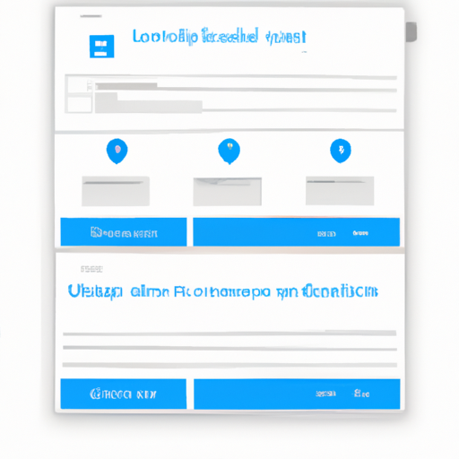

# Building an Open Source RAG Interface using Llama 3.2

Welcome to the world of AI where innovative technologies are at our fingertips! Today, we're diving into an exciting project featured on the AI Anytime YouTube channel, where the host walks us through creating a Retrieval-Augmented Generation (RAG) interface using entirely open source tools. Whether you're a beginner or an experienced developer looking for a fun AI project to add to your portfolio, this blog is for you.

## What is RAG?

Before we get started on building our RAG interface, let’s briefly discuss what RAG is. RAG combines the strengths of traditional search with generative AI models to deliver more accurate and contextually relevant answers. This interface focuses on retrieving information from documents and returning answers in a conversational format—perfect for building your own chatbots!

## Let's Jump into the Project

In this project, we’ll utilize **Llama 3.2**—the latest multimodal model from Meta AI—as our model backend. We’ll create a web application using **Streamlit** and organize our code to ensure it’s clean and reusable. 

### Tools and Technologies Used:

- **Llama 3.2**: Our main model for inference.
- **QRand**: For running vector databases inside a Docker container.
- **LangChain**: To orchestrate various components of our project.
- **BGE**: For generating embeddings, specifically using Beijing AI Academy's model.
- **Unstructured PDF Loader**: To pre-process documents.

## Setting Up Your Environment

We're going to run everything locally on a laptop with just **16 GB of RAM**. Don’t worry if you have a lower spec system; it’s still feasible! 

1. **Docker**: Make sure to have Docker installed to run our vector database smoothly.
2. **Python Libraries**: You'll need a few Python libraries, which we’ll cover in the next sections.

### Loading the Document

The first step in our application is uploading a document. The user interface has three columns: 

1. **Upload Document**: Allows users to upload files.
2. **Create Embeddings**: This step processes the uploaded document and generates embeddings.
3. **Chat with Document**: Once embeddings are created, you can ask questions.

Here is a visual representation of what the UI might look like:

### Processing the Uploaded Document

Once you upload your document (like a case study of gastroesophageal surgery), the app will show a preview of it. This helps ensure you’ve uploaded the correct file. The document is then pre-processed using the **Unstructured PDF Loader**, which parses the content efficiently, allowing us to further manipulate or chunk the document as needed.

### Generating Embeddings

Next up is the embeddings part. The application creates numerical representations of the text data using the BGE model, which allows the machine to process the information effectively. 

#### Why Are Embeddings Important?

Embeddings help convert complex data formats like text into a matrix format that represents that semantic meaning for model training or inference.

### Creating a Vector Database

After generating embeddings, we’ll be storing them in **QRand**’s vector database. The application runs locally, ensuring that your data remains private. You have the option to use either a self-hosted service or a cloud setup, but here, we’re generating everything on our own machine.

### Chat Interface

Now comes the fun part: querying the application! Once you have created the embeddings, the chat function enables users to interact with the document. You can ask questions about the content, and the app provides answers in real time. 

For instance, you could ask “List down all past medical history,” and the app would identify and summarize this information directly from the document.

## Conclusion

And there you have it! We created a functional RAG interface using Llama 3.2—all while working solely with open source tools. This project not only reinforces your understanding of RAG systems but also enhances your programming and AI development skills.

If you're interested in exploring further, be sure to check out the video on YouTube for a deeper dive into the code and architecture. Feel free to explore additional features, like implementing a payment gateway or scaling the app for more complex documents. 

Don't forget to follow the **AI Anytime Channel** for more exciting projects. Happy coding!

---
If you liked this post, please share it or leave a comment below for any queries or feedback!